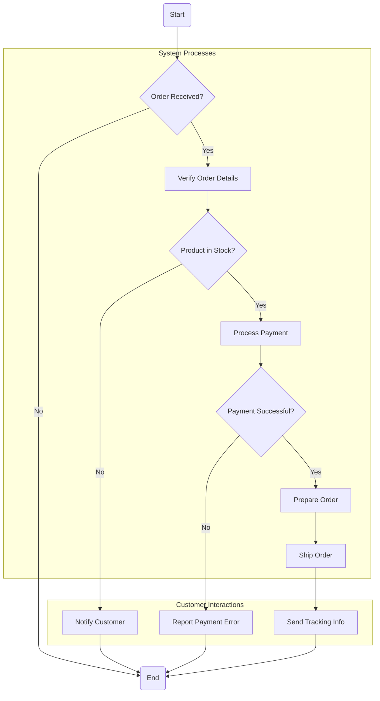

# Bölüm 5: Etkinlik Diyagramları (Activity Diagrams)

## Amaç

Bir süreçteki veya bir operasyondaki iş akışını, adımları (etkinlikler), karar noktalarını, paralel işlemleri ve senkronizasyonları grafiksel olarak modellemek. Genellikle bir kullanım senaryosunun detaylı adımlarını veya bir metodun iç mantığını göstermek için kullanılır.

## Ne Zaman Kullanılır?

1. İş süreçlerini analiz etmek ve modellemek
2. Karmaşık algoritmaların veya metotların mantığını görselleştirmek
3. Bir kullanım senaryosunun adımlarını detaylandırmak
4. Paralel ve eşzamanlı davranışları modellemek

## 5.1. Temel Elemanlar

### Başlangıç Düğümü (Initial Node)

İş akışının başladığı noktayı gösterir. İçi dolu bir daire ile temsil edilir. Her diyagramda genellikle bir tane bulunur.

### Bitiş Düğümü (Final Node / Activity Final Node)

İş akışının bittiği noktayı gösterir. İçi dolu bir dairenin etrafında başka bir daire (boğa gözü) ile temsil edilir. Birden fazla olabilir.

### Eylem / Etkinlik (Action / Activity)

Süreçteki bir adımı veya görevi temsil eder. Köşeleri yuvarlatılmış bir dikdörtgen ile gösterilir. İçine eylemin adı yazılır.

### Akış / Geçiş (Flow / Edge / Transition)

Bir etkinlikten diğerine olan kontrol akışını gösterir. Yönlü bir ok ile temsil edilir.

### Karar Düğümü (Decision Node)

Farklı akış yolları arasında bir seçim noktasını temsil eder. Eşkenar dörtgen (diamond) ile gösterilir. Genellikle bir gelen akışı ve birden fazla giden akışı vardır. Giden akışlar, koşul ifadeleri (guard conditions) ile etiketlenir (örn: [koşul doğru], [koşul yanlış]).

### Birleştirme Düğümü (Merge Node)

Farklı alternatif akış yollarını tek bir akışta birleştirir. Karar düğümü ile aynı sembolü (eşkenar dörtgen) kullanır ancak genellikle birden fazla gelen akışı ve bir giden akışı vardır.

### Çatallanma Düğümü (Fork Node)

Tek bir akışı birden fazla paralel akışa böler. Kalın bir çizgi ile gösterilir. Bir gelen akışı ve birden fazla giden akışı vardır.

### Birleşme Düğümü (Join Node)

Birden fazla paralel akışı tek bir akışta senkronize eder. Çatallanma düğümü ile aynı sembolü (kalın çizgi) kullanır. Birden fazla gelen akışı ve bir giden akışı vardır. Tüm gelen akışlar tamamlanmadan giden akış başlamaz.

### Nesne Düğümü (Object Node)

Bir etkinliğin bir nesne ürettiğini veya kullandığını gösterir. Dikdörtgen ile gösterilir ve içine nesnenin adı ve tipi yazılır (örn: siparis:Siparis).

### Yüzme Kulvarları (Swimlanes / Partitions)

Etkinlik diyagramını, farklı rollerin veya organizasyonel birimlerin sorumlu olduğu bölgelere ayırır. Etkinlikler ilgili kulvar içine yerleştirilir.

## 5.2. Örnek Etkinlik Diyagramı (Online Sipariş Süreci)

