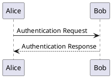

# Bölüm 1: PlantUML Kurulumu ve Entegrasyonu

PlantUML, Java tabanlı bir araçtır ve çalışması için Java Runtime Environment (JRE) veya Java Development Kit (JDK) gereklidir. Ayrıca, diyagramları görselleştirmek için Graphviz (özellikle karmaşık diyagramlar için) kurulması önerilir.

## 1.1. Gerekli Yazılımlar

### Java (JRE veya JDK):

- Eğer sisteminizde Java kurulu değilse, [Oracle JDK](https://www.oracle.com/java/technologies/downloads/) veya [OpenJDK](https://openjdk.java.net/) gibi bir dağıtımı indirip kurun.
- Kurulumu doğrulamak için komut satırına `java -version` yazın. Bir sürüm numarası görmelisiniz.

### Graphviz (Önerilir):

- Diyagramların daha iyi düzenlenmesi ve bazı diyagram türlerinin (örn: Durum, Etkinlik) doğru çizilmesi için gereklidir.
- [Resmi sitesinden](https://graphviz.org/download/) işletim sisteminize uygun sürümü indirip kurun.
- Kurulumdan sonra, Graphviz'in bin klasörünü sisteminizin PATH ortam değişkenine eklemeniz gerekebilir. (Bazı PlantUML entegrasyonları bunu otomatik olarak bulabilir veya yolunu belirtmenizi isteyebilir).

## 1.2. PlantUML'i Edinme ve Kullanım Yolları

PlantUML'i kullanmanın birkaç yolu vardır:

### A. PlantUML JAR Dosyası (Komut Satırı Kullanımı):

1. PlantUML'in [resmi sitesinden](https://plantuml.com/download) en son `plantuml.jar` dosyasını indirin.
2. Metin düzenleyicinizde PlantUML sözdizimiyle bir `.puml` (veya `.txt`, `.plantuml`) dosyası oluşturun.

**Örnek test.puml dosyası:**



3. Komut satırında (terminalde) `.jar` dosyasının bulunduğu dizinde veya `.jar` dosyasının tam yolunu belirterek aşağıdaki komutla diyagramı oluşturun:

```bash
java -jar plantuml.jar test.puml
```

Bu komut, `test.puml` dosyasıyla aynı dizinde `test.png` adında bir resim dosyası oluşturacaktır.

**Farklı formatlarda çıktı almak için:**

- SVG için: `java -jar plantuml.jar -tsvg test.puml`
- Metin (ASCII art) için: `java -jar plantuml.jar -tutxt test.puml`
- Tüm desteklenen formatlar için: `java -jar plantuml.jar -help`

### B. Entegre Geliştirme Ortamları (IDE) Eklentileri:

Bu en pratik yoldur. Yazdığınız PlantUML kodunu anında önizlemenizi sağlar.

#### Visual Studio Code (VS Code):

- **En popüler eklenti:** "PlantUML" by jebbs.
- **Kurulum:** VS Code'da Eklentiler (Extensions) bölümüne gidin, "PlantUML" aratın ve kurun.
- **Kullanım:** Bir `.puml` dosyası açın.
- **Önizleme:** Alt + D (Windows/Linux) veya Option + D (macOS) tuşlarına basın.
- **Dışa Aktarma:** Komut Paleti'ni açın (Ctrl+Shift+P veya Cmd+Shift+P), "PlantUML: Export Current Diagram" yazın ve format seçin.
- Eklenti ayarlarından Graphviz yolunu (gerekirse) ve Java yolunu belirleyebilirsiniz.

#### IntelliJ IDEA / WebStorm / Diğer JetBrains IDE'leri:

- "PlantUML Integration" adında popüler bir eklenti bulunur.
- **Kurulum:** File > Settings (veya Preferences) > Plugins bölümünden aratıp kurun.
- **Kullanım:** `.puml` dosyası açtığınızda genellikle bir önizleme paneli görünür.

#### Eclipse:

- PlantUML için eklentiler mevcuttur (Eclipse Marketplace'ten aratılabilir).

#### Atom, Sublime Text:

- Benzer şekilde PlantUML eklentileri bulunabilir.

### C. Online Editörler ve Sunucular:

- **PlantUML Online Server:** http://www.plantuml.com/plantuml/
  - En basit yol. PlantUML kodunuzu doğrudan tarayıcıya yapıştırıp anında diyagramı görebilir ve indirebilirsiniz. Kurulum gerektirmez.
- **Diğer Online Editörler:** Birçok online Markdown editörü veya dokümantasyon aracı PlantUML'i destekler.

### D. Dokümantasyon Oluşturucularla Entegrasyon:

Sphinx, MkDocs, Doxygen, Asciidoctor gibi araçlar, PlantUML eklentileri sayesinde dokümanlarınızın içine PlantUML diyagramları gömmenize ve doküman oluşturulurken bu diyagramların otomatik olarak üretilmesine olanak tanır.

**Tavsiye:** Günlük kullanım için VS Code + PlantUML eklentisi veya tercih ettiğiniz IDE'deki benzer bir eklenti en verimli yoldur. Hızlı denemeler veya kurulumsuz kullanım için online editörler de çok faydalıdır.

## 1.3. Temel Yapılandırma (VS Code Eklentisi Örneği)

VS Code'daki "PlantUML" eklentisi genellikle iyi varsayılanlarla gelir. Ancak bazen şunları ayarlamanız gerekebilir:

### Graphviz Yolu:

Eğer eklenti Graphviz'i otomatik bulamazsa, VS Code ayarlarında (settings.json veya arayüzden) `plantuml.render` ayarını `Local` yapıp `plantuml.jar` ve `plantuml.commandArgs` (Graphviz için -graphvizdot yolu) ayarlarını yapmanız gerekebilir. Daha güncel eklentilerde bu daha basittir. Genellikle `plantuml.jarArgs` içine `-graphvizdot "/usr/local/bin/dot"` (macOS/Linux) veya `-graphvizdot "C:\Program Files\Graphviz\bin\dot.exe"` (Windows) gibi bir argüman eklenir.

### Java Yolu:

Eklenti Java'yı bulamazsa, sistem `JAVA_HOME` ortam değişkenini kontrol edin veya eklenti ayarlarından Java yürütülebilir dosyasının yolunu belirtin.
